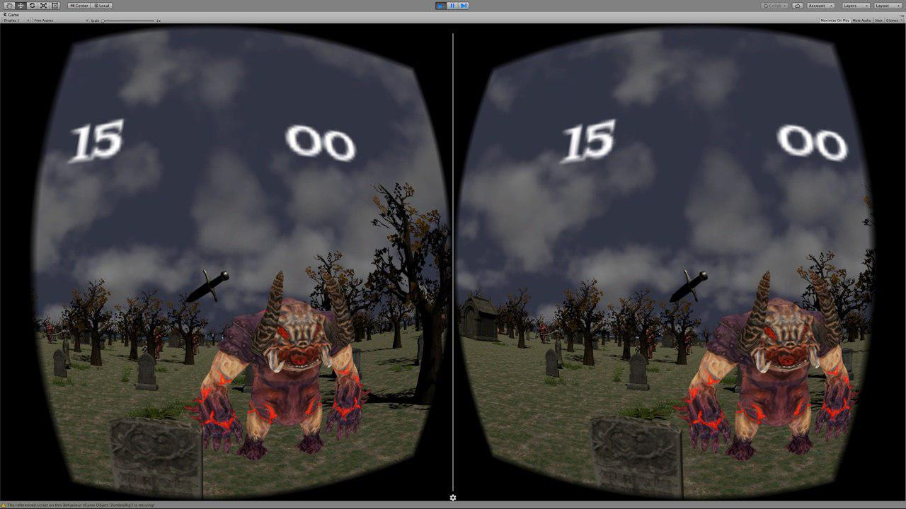

# VIRTUAL REALITY UNITY GAME

**Enlace al video de YouTube:** https://www.youtube.com/watch?v=JQTom9rvaQ0&feature=youtu.be

Es un juego de realidad virtual diseñado para las Google Cardboard, el jugador tiene un minuto para matar el mayor número de enemigos posibles (zombies, brujas, golems y demás criaturas fantásticas). Tiene como arma una daga de plata.

Trancurrido el tiempo aparece una escena final donde se muestra la puntuación obtenida y la opción tanto de jugar otra partida como de salir del programa.

Todo los elementos estéticos como el diseño de los zombies, etc. son prefabs de la Asset Store de Unity. Sin embargo la generación aleatoria de monstruos y elementos del mapa está hecho con scripts en C#. 

Para controlar la puntuación y el reloj también se implementan scripts. 

Por último, el jugador principal lleva scripts para controlar el movimiento del jugador ymanejar todos los efectos, movimientos visuales y lanzamiento de la daga.

## Grupo de trabajo

| Nombre                       | Correo Institucional     | Página Personal                          |
| ---------------------------- | ------------------------ | ---------------------------------------- |
| Jorge Alonso Hernández       | alu0100767803@ull.edu.es | [Jorge](http://alu0100767803.github.io/) |
| Erik Andreas Barreto de Vera | alu0100774054@ull.edu.es | [Erik](https://alu0100774054.github.io/) |

El proyecto se ha dividido en diferentes partes para repartir el trabajo:

- Encontrar Assets de criaturas fantásticas, ambientación, elementos del terreno y texturas para el mapa. Realizado por Jorge Alonso.
- Implementar Scripts para el jugador(movimiento y arma). Realizado por Erik Barreto.
- Implementar Scripts para el manejo del Timer. Realizado por Erik Barreto.
- Implementar el Score del juego. Realizado por Jorge Alonso.
- Implementar Scripts para la generación de elementos del mapa. Realizado por Erik Barreto y Jorge Alonso.
- Encontrar una fuente moderna para el juego. Realizado por Erik Barreto.
- Implementar el Script para cambiar de escena. Realizado por Erik Barreto.
- Implementar el diseño visual de la interfaz del canvas(Menú, score y display). Realizado por Jorge Alonso.